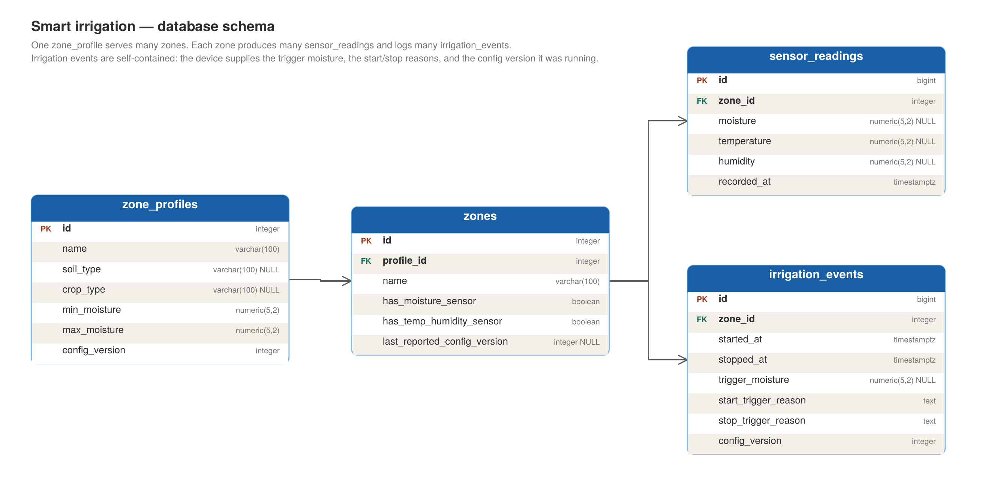

# Smart Irrigation

An autonomous garden irrigation system. An STM32F4 reads soil moisture and
climate sensors, runs the watering control loop, and drives the valves — it
keeps working whether or not the network is up. An ESP32 acts as its
connectivity bridge, relaying telemetry to an ASP.NET Core API over MQTT and
pushing configuration changes back down.

The API stores readings and watering history in PostgreSQL and (eventually)
serves a dashboard.

> Work in progress. The ingest pipeline and schema are complete; firmware and
> frontend are not yet started.

## Stack

- **.NET 10** — ASP.NET Core Web API
- **PostgreSQL 18** — time-series readings and irrigation history
- **EF Core 10** — schema ownership and migrations
- **Dapper** — the high-frequency ingest path
- **MQTTnet 5 / Mosquitto** — device messaging
- **Docker Compose** — broker and database
- **STM32F4 / ESP32** — control and connectivity firmware (planned)

## Architecture

telemetry        STM32F4  ──UART──>  ESP32  ──MQTT──>  Mosquitto  ──>  API  ──>  PostgreSQL

config/commands  STM32F4  <──UART──  ESP32  <──MQTT──  Mosquitto  <──  API  ──>  PostgreSQL

**STM32F4** — reads the sensors, runs the irrigation state machine, drives the
relays, and handles local manual override. It owns every watering decision and
continues operating when the network is down.

**ESP32** — connectivity only. Relays telemetry up and configuration down; holds
no irrigation logic.

**API** — stores readings and watering history, publishes configuration to
devices and manual watering, and serves the dashboard.

The split keeps the deterministic control loop separate from the networking
stack: a WiFi outage or a broker restart can't affect whether a valve opens on
time.

### Consequence: the API records, it does not decide

Because the device is authoritative, an irrigation event is something the API is
*told about*, not something it causes. Events therefore carry everything needed
to interpret them — the moisture value that triggered the watering, how it
started and stopped, and which configuration version the device was running —
rather than referencing rows the API would have to resolve itself.

Configuration flows the other way. The database holds the desired state; devices
converge on it via retained MQTT messages, so a device that has been offline for
a week gets current config the moment it reconnects. Comparing the profile's
`config_version` against the zone's `last_reported_config_version` shows which
zones are out of sync.

Manual watering follows the same downward path: the API publishes a command the
device acts on, and the device then reports the resulting event back up like any
other. Commands are published *without* the retain flag — unlike configuration,
a one-shot instruction must not be replayed to a device that reconnects days
later.

## MQTT topics

Every topic carries the zone in its path, so the broker does the routing and a
subscriber can listen to one zone or all of them. The payload repeats the zone
id, which the API validates against the topic — a mismatch means a device is
confused about its own identity.

| Topic | Direction | Retained | Status |
|---|---|---|---|
| `irrigation/zone{id}/data` | device → API | no | implemented |
| `irrigation/zone{id}/event` | device → API | no | planned |
| `irrigation/zone{id}/status` | device → API | yes | planned |
| `irrigation/zone{id}/config` | API → device | yes | planned |
| `irrigation/zone{id}/command` | API → device | no | planned |

All published at QoS 1. The API acknowledges manually: a message is only
acknowledged once it has been stored, or once it has been judged permanently
unprocessable. Transient failures — a database that is briefly unreachable —
are left unacknowledged so the broker redelivers them.

### `data` — sensor reading

```json
{
  "zoneId": 1,
  "moisture": 15.35,
  "temperature": 20.3,
  "humidity": 66.3,
  "recordedAt": "2026-08-14T09:12:04Z"
}
```

Moisture is a calibrated percentage, not a raw ADC value — the device owns its
own calibration constants. Any of the three sensor values may be null (a
soil-only zone reports moisture alone); all three null is rejected.
`recordedAt` is optional: devices supply it when their clock has been
NTP-synced, otherwise the API stamps arrival time.

## Database



Four tables: `zone_profiles` (watering thresholds), `zones` (the physical
patches), `sensor_readings` (the telemetry stream), and `irrigation_events`
(what the device actually did).

Some decisions worth explaining, since the reasoning isn't visible in the schema
itself:

**Zone and device are one entity.** A zone doesn't have a separate device
record; the assumption is that one controller covers one zone. That pushes
complexity into how the garden is laid out rather than into the schema — if a
patch is too large for one controller, it becomes two zones. If that assumption
ever breaks, `zones` splits into `zones` and `devices`.

**A watering is an event, not a flag on a reading.** An early draft had a
"currently watering" column on `sensor_readings`. That smears one fact across
however many readings happen during a watering, and answering "how long did zone
2 water?" means diffing a flag across thousands of rows. `irrigation_events`
holds one row per completed watering with both timestamps, so duration is
arithmetic on a single row.

**Events are self-contained.** They carry the moisture value that triggered the
watering and the configuration version the device was running, rather than
foreign keys into `sensor_readings`. An earlier version did use those keys —
correctly, while the API was the one making watering decisions. Once the STM32
became authoritative that stopped working: the device can't reference a database
id for a reading it has only just taken, and MQTT gives no ordering guarantee
between topics, so an event can arrive before the reading that caused it.

**Nulls carry meaning in `sensor_readings`.** The three sensor columns are
nullable because a zone may have only a soil probe, or a DHT22 may fail while
the soil probe keeps working. Which columns are populated says which sensors
reported; the `has_moisture_sensor` and `has_temp_humidity_sensor` flags on
`zones` say which *should* have.

**One index.** `sensor_readings (zone_id, recorded_at)` — equality filter first,
range second, which serves both "latest reading for zone X" and "zone X between
two times". Everything else is either a small config table or a foreign key EF
indexes by convention.

## Running it

Prerequisites: .NET 10 SDK, Docker Desktop.

```bash
git clone <repo>
cd IrrigationApi

cp .env.example .env          # set POSTGRES_PASSWORD
docker compose up -d          # Postgres on 5432, Mosquitto on 1883

dotnet user-secrets set "ConnectionStrings:DefaultConnection" \
  "Host=localhost;Port=5432;Database=irrigation;Username=postgres;Password=<yours>" \
  --project IrrigationApi

dotnet ef database update --project IrrigationApi
dotnet run --project IrrigationApi
```

The connection string lives in user secrets rather than `appsettings.json`, so
it never reaches the repository. The password in `.env` is what Compose uses to
initialise Postgres — the two must match.

### Sending a test reading

With the API running, publish to `irrigation/zone1/data` using any MQTT client
(MQTT Explorer, or `mosquitto_pub` inside the broker container):

```bash
docker exec -it mqtt-broker mosquitto_pub \
  -t "irrigation/zone1/data" \
  -m '{"zoneId":1,"moisture":15.35,"temperature":20.3,"humidity":66.3}'
```

A row should appear in `sensor_readings`. Note the zone must already exist —
the foreign key is what enforces that, and a reading for an unknown zone is
logged and discarded.

## Project layout

```
docker-compose.yml          Postgres + Mosquitto
mosquitto/config/           broker configuration
IrrigationApi/
  BackgroundServices/       MQTT client: connection, reconnect, acknowledgement
  Routers/                  topic → handler dispatch
  Handlers/                 one per topic; returns a processing outcome
  Services/                 parsing, validation, persistence
  Entities/ Data/           EF Core model and DbContext
  DTOs/                     wire formats
  Migrations/
```

Message handling is split three ways so each part can be tested on its own.
`MqttClientService` knows about connections and acknowledgement but nothing
about payloads. The router matches topics to handlers and knows nothing about
what they do. Handlers and services parse and store, and never see a broker.

Adding a topic means writing a handler and registering it — the client builds
its subscription list from the registered handlers, so subscriptions and
dispatch can't drift apart.

## Roadmap

- [x] Schema, migrations, Docker infrastructure
- [x] MQTT ingest with reconnect and manual acknowledgement
- [x] Sensor readings persisted to Postgres
- [ ] Irrigation event handler
- [ ] Device status and configuration sync
- [ ] REST API for zones and profiles
- [ ] Dashboard with live updates (SignalR)
- [ ] STM32 firmware: sensors, control loop, valve driver
- [ ] ESP32 firmware: WiFi, MQTT bridge, UART link